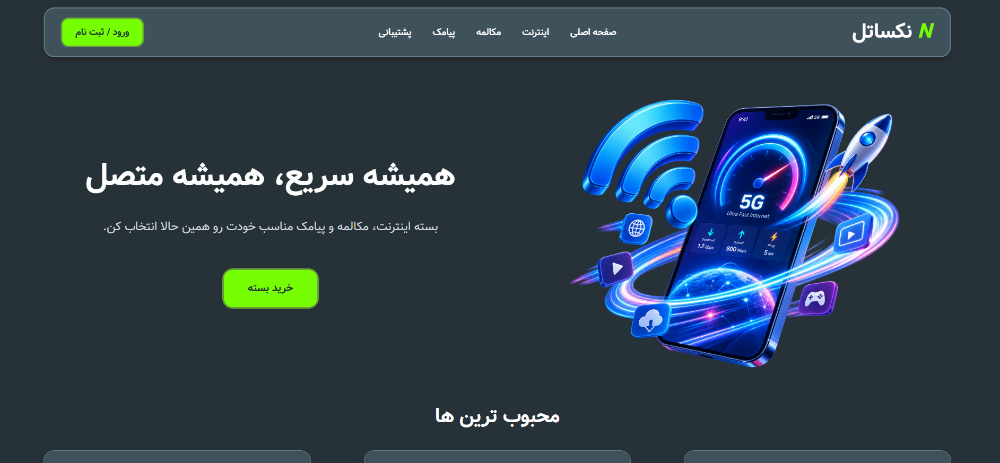

# Nexatel | نکساتل

A modern, responsive telecom package shopping web application built with Next.js and TypeScript.

Nexatel is a fictional telecom operator website designed to provide an online shopping experience for **internet, call, and SMS packages**.

## 🚀 Live Demo

[View Nexatel Live Demo](https://naeemt8.github.io/nexatel/)

## 📸 Preview



## ✨ Features

* Responsive design for desktop, tablet, and mobile
* Internet, call, and SMS package categories
* Package filtering and browsing
* Package details
* Shopping cart
* Modern RTL interface designed for Persian users
* Reusable and component-based UI
* Deployed with GitHub Pages

## 🛠️ Tech Stack

* Next.js
* React
* TypeScript
* Tailwind CSS
* Next.js App Router

## 📁 Project Structure

The project follows a component-based architecture with reusable UI components and separated static data.

## ⚙️ Getting Started

Clone the repository:

```bash
git clone https://github.com/naeemt8/nexatel.git
```

Install dependencies:

```bash
npm install
```

Run the development server:

```bash
npm run dev
```

Open http://localhost:3000 in your browser.

## 📌 Purpose

Nexatel was developed as a portfolio project to demonstrate practical skills in modern frontend development with **React, Next.js, TypeScript, and Tailwind CSS**.

## 👨‍💻 Author

**Naeem Taleghani**

[GitHub](https://github.com/naeemt8)
